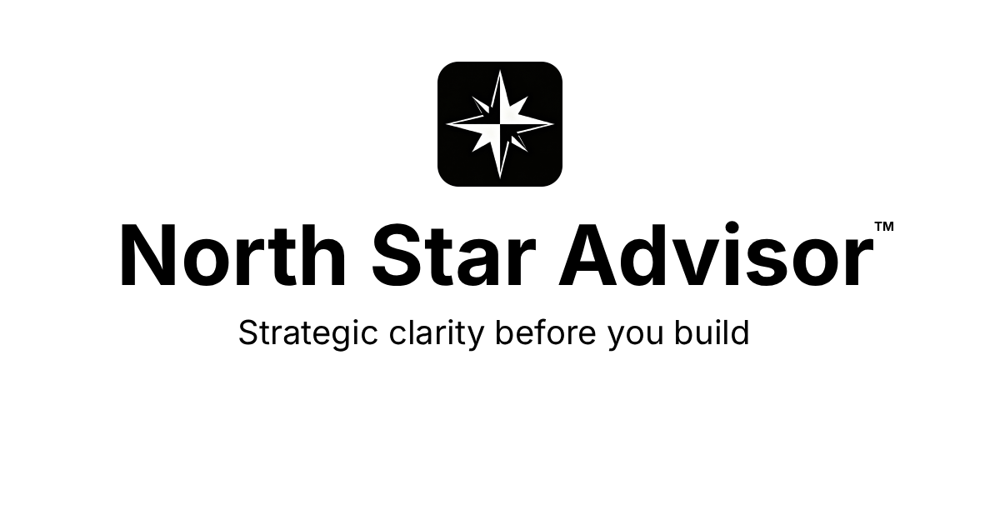

# North Star Advisor™

Strategic document generation for agentic applications. A Claude Code plugin that acts as your thinking partner to generate 22 design documents following the North Star methodology.

## Overview

North Star Advisor helps you plan AI-native applications through:

1. **Strategic Discovery** - Open exploration to articulate what you're building
2. **Domain Research** - 4 parallel agents research tech, features, architecture, and pitfalls
3. **Document Generation** - 22 strategic documents informed by research

## Installation

### From Claude Code Marketplace

```bash
# Add the marketplace
/plugin marketplace add AI-Native-Systems/north-star-advisor

# Install the plugin
/plugin install north-star-advisor@ans
```

### Manual Installation

```bash
# Clone to plugins directory
git clone https://github.com/AI-Native-Systems/north-star-advisor.git \
  ~/.claude/plugins/north-star-advisor

# Restart Claude Code to load the plugin
```

## Quick Start

```bash
# Start strategic discovery
/northstar:advisor

# Research and generate documents
/northstar:advisor-build

# Check progress
/northstar:status
```

## Workflow

### Step 1: `/northstar:advisor`

The advisor acts as your thinking partner:

1. **Open Exploration** - "What are you building, and why does it need to exist?"
2. **Follow-up Questions** - Challenges vague answers until concrete
3. **Understanding Checkpoint** - Verifies shared understanding before proceeding
4. **Save State** - Creates discovery.md, inputs.yml, ai-context.yml

### Step 2: `/northstar:advisor-build`

Research and generate strategic documents:

1. **Research Phase** - 4 parallel agents gather domain insights
   - Tech Stack: Frameworks, libraries, best practices
   - Features & UX: Expected features, UX patterns
   - Architecture: Patterns, data flow, scalability
   - Pitfalls: Common mistakes, security concerns

2. **Research Checkpoint** - Review findings before generation

3. **Generation** - 13 phases create strategic documents
   - Research informs Phases 6 (Architecture), 7 (Agents), 8 (Security)

## Commands

| Command | Description |
|---------|-------------|
| `/northstar:advisor` | Strategic discovery through open exploration |
| `/northstar:advisor-build` | Research and generate documents |
| `/northstar:status` | Show research and generation progress |
| `/northstar:resume` | Continue from last checkpoint |
| `/northstar:help` | Show available commands |

## Generation Flags

| Flag | Description | Templates |
|------|-------------|-----------|
| (none) | Core strategic documents | 12 templates |
| `--ux` | Add UX design templates | +3 (15 total) |
| `--deep` | Add architecture templates | +7 (19 total) |
| `--full` | All templates | 22 total |

## Templates

### Core Templates (12) → `docs/`

1. **BRAND_GUIDELINES** - Product name, beliefs, kill list, voice
2. **NORTHSTAR** - North Star metric, personas, success phases
3. **COMPETITIVE_LANDSCAPE** - Market analysis, competitor features
4. **NORTHSTAR_EXTRACT** - Axioms, non-goals, constraints
5. **ARCHITECTURE_BLUEPRINT** - Agent topology, tech stack
6. **SECURITY_ARCHITECTURE** - Threats, auth, safety guardrails
7. **ADR** - Architecture decision records
8. **POST_DEPLOYMENT** - Monitoring, maintenance, runbook
9. **STRATEGIC_RECOMMENDATION** - Paths, trade-offs, decisions
10. **ACTION_ROADMAP** - 30-60-90 day actions
11. **INDEX** - Documentation hub
12. **OPERATIONS_RUNBOOK** - Production operations (optional)

### Design Templates (--ux, 3) → `docs/design/`

- **USER_JOURNEYS** - Emotional journey maps per persona
- **UI_DESIGN_SYSTEM** - Design tokens, components, patterns
- **ACCESSIBILITY** - WCAG 2.1 AA compliance patterns

### Architecture Templates (--deep, 7) → `docs/architecture/`

- **AGENT_PROMPTS** - System prompts per agent
- **PIPELINE_ORCHESTRATION** - Agent coordination patterns
- **RESILIENCE_PATTERNS** - Circuit breakers, retries, fallbacks
- **IMPLEMENTATION_SCAFFOLD** - Project structure, setup
- **OBSERVABILITY** - Logging, tracing, alerting
- **TESTING_STRATEGY** - Test plans, golden datasets
- **HANDOFF_PROTOCOL** - Agent-to-agent delegation

## Research Phase

Before generation, 4 research agents run in parallel to gather domain insights:

| Agent | Focus |
|-------|-------|
| Tech Stack | Frameworks, libraries, best practices for your tech choices |
| Features & UX | Expected features, UX patterns, accessibility |
| Architecture | Patterns, data flow, scalability considerations |
| Pitfalls | Common mistakes, anti-patterns, security concerns |

Research is cached for 24 hours. Findings inform Phases 6, 7, and 8.

## Progressive AI Context

The `ai-context.yml` file grows as generation progresses:

**Location:** `north-star-advisor/ai-context.yml`

| Phase | Context Added |
|-------|---------------|
| advisor | Project name, description, users, differentiator, tech_stack |
| 1 | Beliefs, kill list, brand voice |
| 2 | North Star metric, measurement, personas |
| 3 | Competitors, differentiation |
| 4 | Axioms, non-goals, constraints |
| 5a-c | Design journeys, tokens, accessibility (--ux) |
| 6 | Architecture pattern, agents, tech stack |
| 7 | Agent prompts (summaries) |
| 8 | Auth pattern, threats, guardrails |
| 9 | ADR decisions |
| 10 | Monitoring, alerts |
| 11 | Recommended path, trade-offs |
| 12 | Roadmap phases |
| 13 | Document references |

## State Persistence

All progress is saved to `north-star-advisor/`:

```
north-star-advisor/
├── ai-context.yml            # Strategic context for Claude Code
├── .work-in-progress/        # Hidden - active session data
│   ├── state.json            # Generation progress
│   ├── inputs.yml            # User inputs from advisor
│   ├── discovery.md          # Exploration notes
│   ├── outputs/              # Extracted data for cross-refs
│   ├── checkpoints/          # Resume points
│   └── research/             # Cached domain research
│       ├── summary.md
│       ├── tech-stack.md
│       ├── features-ux.md
│       ├── architecture.md
│       └── pitfalls.md
└── docs/                     # Generated strategic documents
```

Resume anytime with `/northstar:resume`.
Export for sharing with `/northstar:export`.

## Validation

Every document passes through validation gates that ensure:

- Required sections are present
- Cross-references resolve correctly
- Content meets quality standards
- Terminology is consistent

Validation is **blocking** by default - failures stop generation until fixed.

## Requirements

- Claude Code CLI
- Claude subscription (uses subscription credits, no API key needed)

## License

MIT

## Author

Patrick Pena / [AI Native Systems™](https://ainativesystems.io)

## Links

- [Documentation](https://github.com/AI-Native-Systems/north-star-advisor)
- [Issues](https://github.com/AI-Native-Systems/north-star-advisor/issues)
