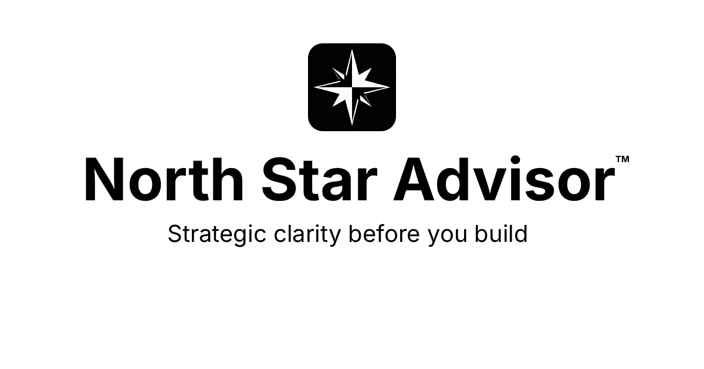

# North Star Advisor™

Strategic document generation for agentic applications. A Claude Code plugin that acts as your thinking partner to generate 21 design documents following the North Star methodology. The output is a structured documentation system that can be handed off to Claude Code providing it with details of what to build, what not to build, how to build it, and how to talk about it.

## Overview

North Star Advisor helps you plan AI-native applications through:

1. **Strategic Discovery** - Open exploration to articulate what you're building
2. **Domain Research** - 4 parallel agents research tech, features, architecture, and pitfalls
3. **Document Generation** - 21 strategic documents informed by research

## Installation

```bash
# Add the marketplace
/plugin marketplace add AI-Native-Systems/north-star-advisor

# Install the plugin
/plugin install northstar@ans
```

## Quick Start

```bash
/northstar:advisor        # Strategic discovery
/northstar:advisor-build  # Research and generate documents
/northstar:status         # Check progress
```

## Commands

| Command | Description |
|---------|-------------|
| `/northstar:advisor` | Strategic discovery through open exploration |
| `/northstar:advisor-build` | Research and generate documents |
| `/northstar:status` | Show research and generation progress |
| `/northstar:resume` | Continue from last checkpoint |
| `/northstar:export` | Package docs into shareable zip |
| `/northstar:help` | Show available commands |

## Flags

| Flag | Description | Templates |
|------|-------------|-----------|
| (none) | Core strategic documents | 12 templates |
| `--ux` | Add UX design templates | +3 (15 total) |
| `--deep` | Add architecture templates | +6 (18 total) |
| `--full` | All templates | 21 total |
| `--search-tool <tool>` | Use custom search tool for research | - |

## After Generation

The generated documents form a complete strategic blueprint. Point Claude Code at these docs and it will understand:

- **What to build** - Features, user journeys, success metrics
- **What NOT to build** - Kill list, non-goals, out-of-scope items
- **How to build it** - Architecture patterns, agent topology, security guardrails
- **How to talk about it** - Brand voice, terminology, beliefs

Add to your project's `CLAUDE.md`:

```markdown
## Strategic Context

This project was planned using North Star Advisor.
Before implementing features, read:

- `north-star-advisor/ai-context.yml` - Strategic context (start here)
- `north-star-advisor/docs/INDEX.md` - Documentation hub
```

## Learn More

- [Methodology](references/methodology.md) - Generation phases and principles
- [Validation Gates](references/validation-gates.md) - Per-phase validation rules
- [Data Flow](references/data-flow.md) - How data moves through generation

## Requirements

- Claude Code CLI
- Claude subscription (uses subscription credits, no API key needed)

## License

MIT

## Author

Patrick Pena / [AI Native Systems™](https://ainativesystems.io)

## Links

- [Documentation](https://github.com/AI-Native-Systems/north-star-advisor)
- [Issues](https://github.com/AI-Native-Systems/north-star-advisor/issues)
